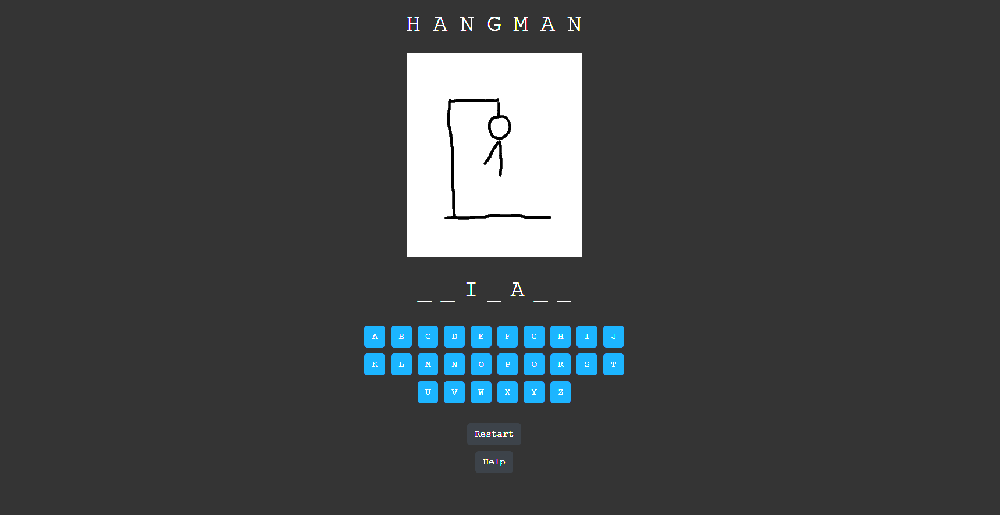

# React & Hangman

Simple hangman game created using React.

## Usage
- To install node necessary dependencies, run the following command: `npm install`
- To start the development server, run the following command:`npm start`

## Hangman Rules

1: Attempt to reveal/guess the word by clicking the letters.

2: You have limited number of lives and you lose a life if wrong letter is clicked.

3: Restart when ever you desire.

4: Click the Help button to see the rules.

## Screenshots

*Game page*
